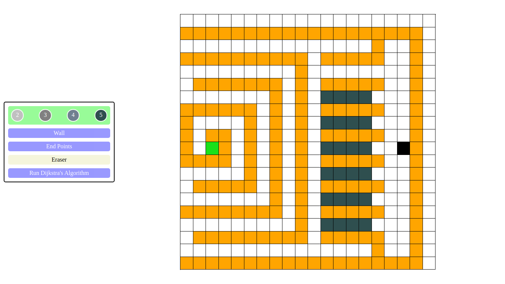
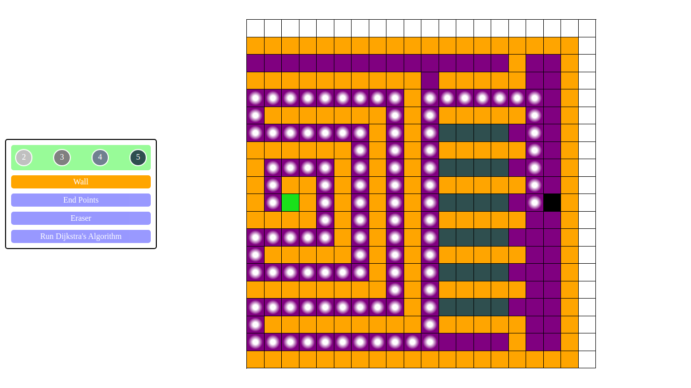

# Path-find-demo

Applied dijkstra algorithm to find the minimum cost path.

## Walls

- Use wall buttons to create walls of orange color.
- dijkstra algorithm ignores the walls.

## Weights

- Weights are a way to add cost to path.
- By default the cost to reach each cell from the adjacent cell is one.
- We can increase cost by using weights.
- The range of weights available is 2-5 inclusive.

## Start Point and End Point

- To change the start position drag the green box to your desired position.
- Do the same for end point by draging black box.

# 

## Propagating purple box

- The propagating purple box is the working Dijkstra Algorithm.
- It visits each cell to find the minimum cost path to reach end point i.e. black box

## Path

- After visiting every cell and finding the minimum cost path a path is drawn.
- Path is shown with white dotted cells connecting the start and the end points.

# 

[Know more about me](https://vishwaspaikra007.github.io/portfolio-vishwas-paikra/)
